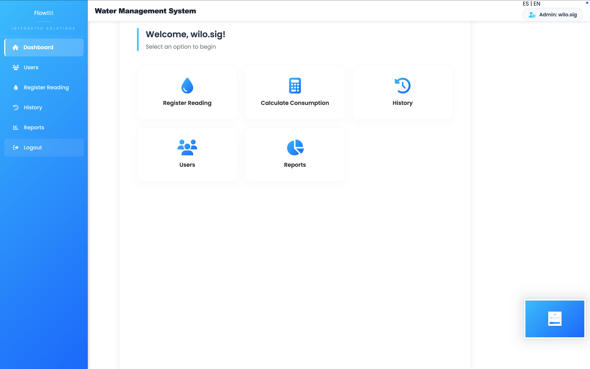
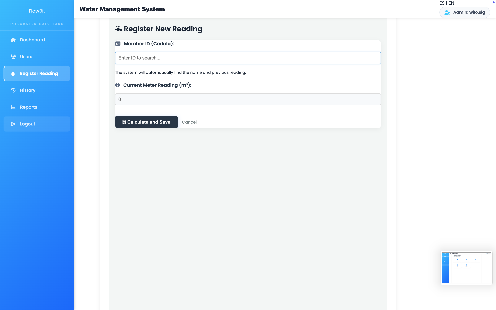
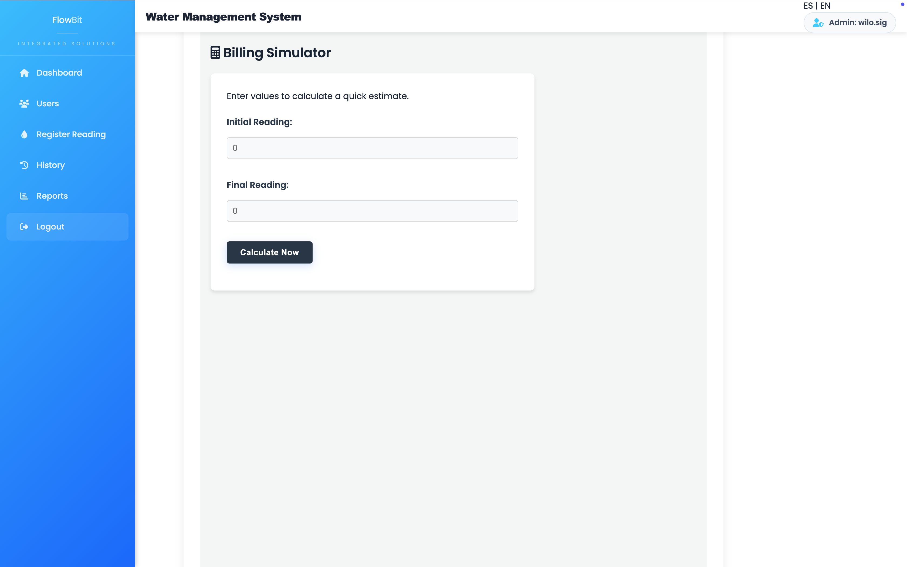
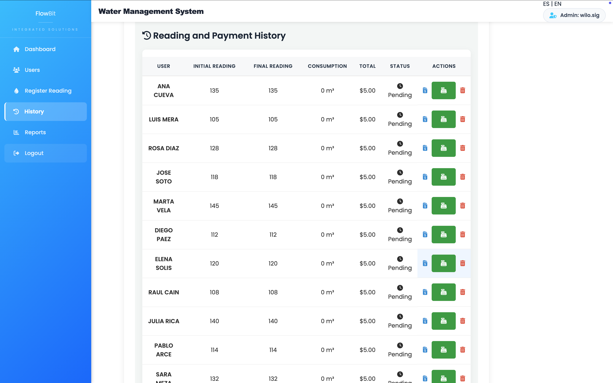
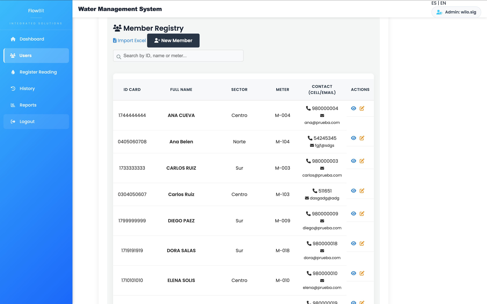
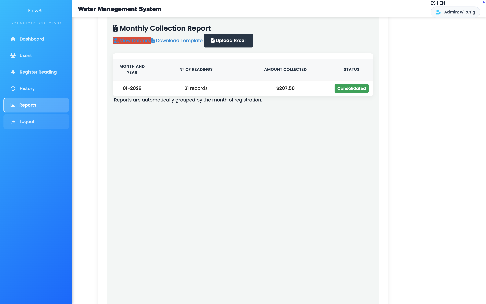

# FlowBit - Water Management System 💧

**FlowBit** is an intuitive, modern, and production-ready web application designed to streamline water meter tracking, community billing, and member registries. 

Built with a robust Python backend and an elegant user interface, the system solves real-world administrative challenges by automating monthly calculations, offering multi-language capabilities, and supporting bulk data processing via Microsoft Excel.

---

## 📸 Core Modules & Features

### 1. Secure Access Control (Login)

* **Secure Authentication:** Features a robust login interface connected to the SQLite backend to authenticate administrators safely.
* **Modern UI/UX Design:** Implements a clean, centered credential form styled with CSS3 gradients, smooth drop-shadow effects, and responsive design principles.
* **Session Protection:** Restricts unauthorized database and dashboard access by managing secure state flows across routes.

---

### 2. Main Dashboard

* **Centralized Navigation:** Provides administrators with an intuitive control hub featuring dynamic card layouts to jump directly into core actions.
* **Dynamic User Greeting:** Displays personalized greeting messages based on the active session variables (e.g., *Welcome, wilo.sig!*).
* **Localization Control (I18n):** Features a global translation switcher in the upper-right corner for seamless, real-time swapping between **ES | EN**.

---

### 3. Register New Reading

* **Real-time Member Search:** Dynamically fetches and matches the subscriber's name and their previous meter status as soon as the administrator enters their ID Card (Cédula).
* **Smart Data Validation:** Prevents human data entry errors by automatically loading the last verified record before accepting the current month's cubic meter ($m^3$) input.
* **Streamlined Workflow:** Features an optimized form design with clear action buttons (*Calculate and Save* / *Cancel*) that keep user actions fast and accurate.

---

### 4. Billing Simulator

* **Quick Estimation Engine:** Allows administrators to run instant billing math inputs by evaluating custom meter ranges on-the-fly.
* **Non-Persistent Calculations:** Processes differences between initial and final values seamlessly without pushing unverified data into the main SQLite tables.
* **Lightweight UI Layout:** Uses a responsive clean-card interface that provides a user-friendly way to double-check client questions regarding tariff ranges.

---

### 5. Reading & Payment History

* **Live Status Auditing:** Displays a clear administrative matrix tracking consumption records, pricing totals, and active transaction markers (*Pending / Paid*).
* **Automated Consumption Delta:** Pulls stored initial and final matrix values to automatically display the net cubic meter ($m^3$) calculation per subscriber.
* **Inline Administrative Actions:** Employs action hooks per row allowing direct cash registration and records removal, keeping debt sheets constantly updated.

---

### 6. Member Registry (CRUD)

* **Comprehensive Subscriber Database:** Manages full records for community members including ID Cards (Cédula), unique water meter identifiers, and geographical sectors (*Centro, Norte, Sur*).
* **Multi-Criteria Search Filter:** Features an interactive search bar enabling administrators to instantly filter the entire tabular grid by ID, name, or meter number.
* **Unified Contact & Operations Hub:** Organizes phone and email data neatly using clean modern typography, while integrating direct action triggers to view profiles or execute subscriber updates.

---

### 7. Monthly Reports & Excel Automation

* **Automated Data Aggregation:** Dynamically groups community billing entries into monthly consolidated summaries, rendering net metrics like total records processed and income generated ($207.50).
* **Bulk Data Processing via Excel:** Integrates template downloading and an intelligent `Upload Excel` pipeline, bypassing tedious single-form lines to manage entire neighborhoods at once.
* **Debtor Analytics Integration:** Features dedicated quick-links (*View Debtors*) to instantly slice financial ledgers and target pending balances for localized administrative management.

---

## 🛠️ Tech Stack

* **Backend:** Python 3.13 + [Flask](https://flask.palletsprojects.com/)
* **Data Processing:** [Pandas](https://pandas.pydata.org/) (For dynamic Excel import/export generation)
* **Database:** SQLite 3 (Relational queries and local storage)
* **Frontend:** HTML5, Custom CSS3 grid/flexbox layout, Native JavaScript
* **Internationalization (I18n):** Native support for **ES (Spanish) | EN (Inglés)** dynamic switching

---

## 🚀 Key Advantages

1. **Automated Metrics:** Instantly calculates water consumption ($m^3$) and rates using database-driven formulas.
2. **Modular Architecture:** Features clean separation of concerns with structured Jinja2 templates and distinct stylesheets (`content_tables.css`, `forms_buttons.css`).
3. **Repository Best Practices:** Secure project structure with strict `.gitignore` protection for local databases, environments, and Mac system artifacts (`.DS_Store`).

---

## 📦 Local Installation

Follow these steps to run this project locally:

### 1. Clone the Repository
```bash
git clone [https://github.com/YOUR_USERNAME/sistema-agua.git](https://github.com/wilmersiguencia/sistema-agua.git)
cd sistema-agua